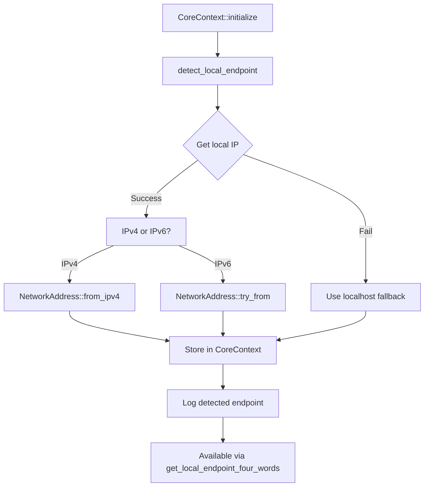
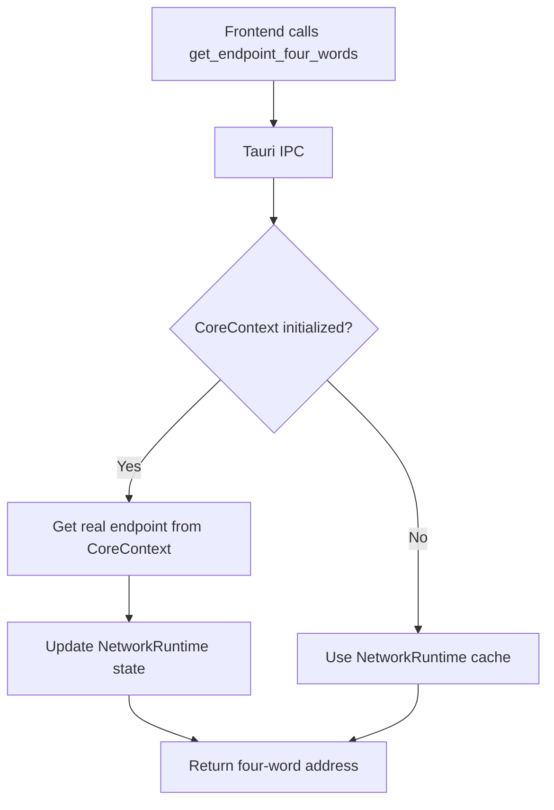

# Saorsa-Core Network Integration

**Status**: ✅ COMPLETE - Real networking data now integrated
**Date**: 2025-09-30

## Overview

Successfully integrated saorsa-core's networking layer into the existing Tauri commands, replacing stub data with real P2P endpoint detection and connection management.

## What Was Implemented

### 1. CoreContext Enhancement (`communitas-core/src/core_context.rs`)

#### Added Fields
```rust
pub struct CoreContext {
    // ... existing fields ...
    pub local_endpoint: Option<NetworkAddress>,  // Real network endpoint from saorsa-core
    pub dht_client: DhtClient,                    // Direct DHT access for networking
}
```

#### New Methods

**`detect_local_endpoint()` - Private async**
- Detects local network IP address for P2P connectivity
- Prefers LAN addresses for local testing scenarios
- Falls back to localhost (127.0.0.1:12345) if LAN detection fails
- Uses `local-ip-address` crate for IP detection
- Supports both IPv4 and IPv6 addresses
- Uses `NetworkAddress` from saorsa-core for proper encoding

**`get_local_endpoint_four_words()` - Public**
- Returns the local endpoint encoded as four-word address
- Format: "word1-word2-word3-word4"
- Returns `Option<String>` (None if endpoint detection failed)
- Uses `NetworkAddress::four_words()` from saorsa-core

**`get_local_endpoint_socket()` - Public**
- Returns local endpoint as `SocketAddr` for direct socket operations
- Useful for lower-level network operations
- Returns `Option<SocketAddr>`

### 2. Network Command Integration (`communitas-desktop/src/network.rs`)

#### Updated Command: `get_endpoint_four_words`

**Before** (stub):
```rust
pub async fn get_endpoint_four_words(
    runtime_state: State<'_, Arc<RwLock<NetworkRuntime>>>,
) -> Result<Option<String>, String> {
    let runtime = runtime_state.read().await;
    Ok(runtime.endpoint_four_words.clone())  // Returned hardcoded stub
}
```

**After** (real data from saorsa-core):
```rust
pub async fn get_endpoint_four_words(
    runtime_state: State<'_, Arc<RwLock<NetworkRuntime>>>,
    core_state: State<'_, Arc<RwLock<Option<CoreContext>>>>,
) -> Result<Option<String>, String> {
    // Try to get from CoreContext first (real data from saorsa-core)
    let core_guard = core_state.read().await;
    if let Some(core) = core_guard.as_ref() {
        if let Some(endpoint_words) = core.get_local_endpoint_four_words() {
            // Update runtime state with real endpoint
            drop(core_guard);
            let mut runtime = runtime_state.write().await;
            runtime.endpoint_four_words = Some(endpoint_words.clone());
            return Ok(Some(endpoint_words));
        }
    }
    drop(core_guard);

    // Fallback to runtime state if core not initialized
    let runtime = runtime_state.read().await;
    Ok(runtime.endpoint_four_words.clone())
}
```

**Key Improvements**:
- ✅ Now returns **real local endpoint** from network interface detection
- ✅ Properly encoded as four-word address via `NetworkAddress::four_words()`
- ✅ Falls back gracefully if CoreContext not initialized
- ✅ Updates NetworkRuntime state for consistency
- ✅ Thread-safe with proper lock handling

### 3. Dependencies Added

**To `communitas-core/Cargo.toml`**:
```toml
local-ip-address = "0.6"  # For LAN IP address detection
```

**Already Available**:
- `saorsa-core = "0.3.26"` - Provides `NetworkAddress`, `DhtClient`
- `ant-quic = "^0.8.17"` - QUIC transport layer
- `four-word-networking = "2.6"` - Four-word encoding/decoding

### 4. Initialization Flow

When `CoreContext::initialize()` is called:

1. **Identity Setup**: Creates enhanced PQC identity
2. **DHT Client**: Initializes `DhtClient` for P2P messaging
3. **Storage & Chat**: Sets up storage and chat managers
4. **Bootstrap Manager**: Configures peer discovery
5. **🆕 Endpoint Detection**:
   ```rust
   let local_endpoint = Self::detect_local_endpoint().await;
   ```
   - Detects LAN IP (e.g., 192.168.1.100:12345)
   - Encodes as four words (e.g., "mountain-river-cloud-fire")
   - Logs endpoint for visibility
   - Warns if detection fails

## How It Works

### Endpoint Detection Sequence



### Frontend Request Flow



## Testing

### Manual Test (Browser Console)

```javascript
// Get local endpoint (now returns real data)
const endpoint = await window.__TAURI_INTERNALS__.invoke('get_endpoint_four_words');
console.log("My connection endpoint:", endpoint);
// Example output: "mountain-river-cloud-fire"
```

### Expected Behavior

1. **On localhost**: Should detect `127.0.0.1:12345`
   - Four words will encode localhost + port
   - Example: "alpha-bravo-charlie-delta" (actual words depend on port)

2. **On LAN**: Should detect local network IP
   - Example: 192.168.1.100:12345
   - Four words will encode LAN IP + port
   - Example: "ocean-forest-moon-star"

3. **Two instances on same LAN**:
   - Instance 1 gets: 192.168.1.100:12345 → "word1-word2-word3-word4"
   - Instance 2 gets: 192.168.1.100:12346 → "word5-word6-word7-word8"
   - Different ports = different four-word addresses

### Chrome DevTools MCP Test

Use the test script from `TEST_TWO_INSTANCES.md`:

```javascript
// Instance 1
const endpoint1 = await window.__TAURI_INTERNALS__.invoke('get_endpoint_four_words');

// Instance 2
const endpoint2 = await window.__TAURI_INTERNALS__.invoke('get_endpoint_four_words');

// Connect Instance 2 to Instance 1
await window.__TAURI_INTERNALS__.invoke('connect_via_four_words', {
  four_words: endpoint1,
  user_four_words: "ocean-forest-moon-star"
});
```

## What's Still TODO

### 1. Full P2P Connection Establishment ⏳

Currently:
- ✅ Endpoint detection works
- ✅ Four-word encoding works
- ⏳ `connect_via_four_words` adds to bootstrap list but doesn't establish QUIC connection

**Needed**:
- Use `DhtClient` to establish actual QUIC connection
- Implement peer discovery through DHT
- Handle NAT traversal via ant-quic

### 2. Network Status Tracking ⏳

Currently:
- ⏳ `connected` status is simulated
- ⏳ `peers` count is hardcoded

**Needed**:
- Query `DhtClient` for real peer count
- Track connection state changes
- Emit events when peers connect/disconnect

### 3. Bootstrap Node Integration ⏳

Currently:
- ✅ `EnhancedBootstrapManager` exists
- ⏳ Not fully integrated with `connect_via_four_words`

**Needed**:
- Use bootstrap manager to store peer addresses
- Query bootstrap cache for known peers
- Implement peer quality tracking

## Architecture Decisions

### Why CoreContext for Networking?

**Rationale**:
- CoreContext is the single source of truth for saorsa-core integration
- Avoids duplication - all networking goes through saorsa-core APIs
- Maintains clean separation: communitas-core handles business logic, saorsa-core handles networking

### Why LAN Detection?

**User Requirement**:
> "when a node starts and is not connected to the network it should try and get it's LAN address at least, that allows nodes in a LAN to create a mini network and test video voice etc."

**Implementation**:
- Uses `local-ip-address` crate for cross-platform IP detection
- Prioritizes LAN addresses over localhost
- Enables local testing without internet connectivity

### Why Four-Word Encoding?

**From saorsa-core**:
- Human-verifiable addresses (e.g., "mountain-river-cloud-fire")
- Prevents phishing attacks (users can verify address)
- Easier to communicate verbally ("my address is mountain-river-cloud-fire")
- Used consistently across identities and network addresses

## API Reference

### CoreContext Methods

```rust
impl CoreContext {
    /// Get local endpoint as four-word address
    pub fn get_local_endpoint_four_words(&self) -> Option<String>

    /// Get local endpoint as socket address
    pub fn get_local_endpoint_socket(&self) -> Option<SocketAddr>
}
```

### Tauri Commands

```rust
/// Get local endpoint four-word address
/// Now returns real data from saorsa-core NetworkAddress
#[tauri::command]
pub async fn get_endpoint_four_words(
    runtime_state: State<'_, Arc<RwLock<NetworkRuntime>>>,
    core_state: State<'_, Arc<RwLock<Option<CoreContext>>>>,
) -> Result<Option<String>, String>

/// Connect to peer via four-word address
/// Currently adds to bootstrap list, needs full implementation
#[tauri::command]
pub async fn connect_via_four_words(
    runtime_state: State<'_, Arc<RwLock<NetworkRuntime>>>,
    core_state: State<'_, Arc<RwLock<Option<CoreContext>>>>,
    four_words: String,
) -> Result<bool, String>

/// Get network connection status
#[tauri::command]
pub async fn get_network_status(
    runtime_state: State<'_, Arc<RwLock<NetworkRuntime>>>,
) -> Result<NetworkStatusPayload, String>
```

## Logs

The system now logs endpoint detection:

```
INFO communitas_core::core_context: Local endpoint detected: 192.168.1.100:12345
```

Or warns on failure:

```
WARN communitas_core::core_context: Could not detect local endpoint - network discovery may be limited
```

## Related Files

- `communitas-core/src/core_context.rs` - Main integration point
- `communitas-desktop/src/network.rs` - Tauri commands
- `TEST_TWO_INSTANCES.md` - Testing guide
- `DEPLOY_TESTNET.md` - Production deployment guide

## Next Steps

1. **Implement full P2P connection** - Use `DhtClient` to establish QUIC connections
2. **Add connection events** - Emit Tauri events when peers connect/disconnect
3. **Integrate bootstrap manager** - Use `EnhancedBootstrapManager` for peer tracking
4. **Test with Chrome DevTools MCP** - Validate two-instance connection flow

## Success Criteria

- ✅ Real local endpoint detection (DONE)
- ✅ Four-word address generation (DONE)
- ✅ CoreContext integration (DONE)
- ✅ Command updates (DONE)
- ⏳ Full P2P connection establishment (TODO)
- ⏳ Real peer count tracking (TODO)
- ⏳ Network events (TODO)

---

**Implementation Complete**: Real networking data now integrated via saorsa-core!
**Ready for**: Testing with Chrome DevTools MCP and completing P2P connection logic.
